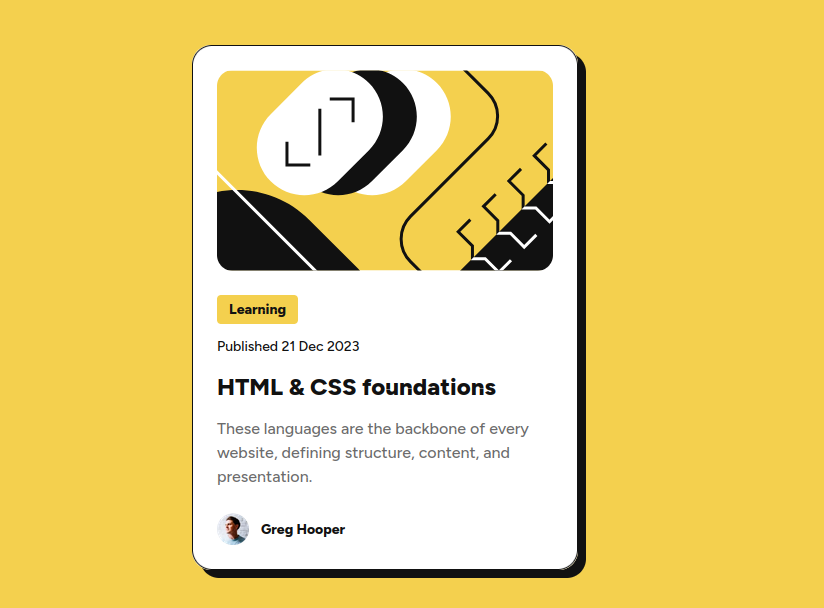

# Frontend Mentor - Blog preview card solution

This is a solution to the [Blog preview card challenge on Frontend Mentor](https://www.frontendmentor.io/challenges/blog-preview-card-ckPaj01IcS). Frontend Mentor challenges help you improve your coding skills by building realistic projects. 

## Table of contents

  - [Screenshot](#screenshot)
  - [Links](#links)
  - [Built with](#built-with)
  - [What I learned](#what-i-learned)
- [Author](#author)

### Screenshot

### Links

- Solution URL: [Github](https://github.com/mani-cmd/basic-blog-card)
- Live Site URL: [Github pages](https://mani-cmd.github.io/basic-blog-card/)

### Built with
- SASS workflow
- CSS custom properties
- Flexbox
- CSS Grid

### What I learned

I remastered some of my lost skills and delved further in my responsive webdesign skills

## Author

- Frontend Mentor - [@mani-cmd](https://www.frontendmentor.io/mani-cmd/yourusername)
- X.com - [@manikandanx0](https://www.twitter.com/manikandanx0)
